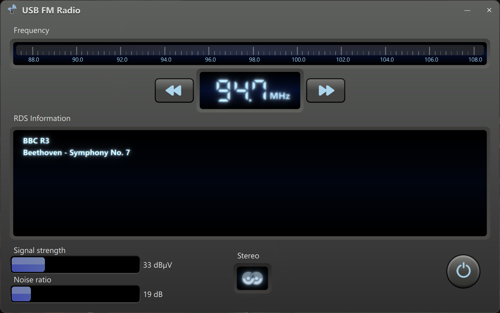

# The GUI

This folder contains the graphical user interface application for controlling the radio device.

## Working on the project

This project uses Qt 6.10.2 together with Microsoft Visual Studio Build Tools 2022. Begin by visiting [this page](https://www.qt.io/development/download-qt-installer-oss) and choose the right Qt installer for your system.

From the Qt installer, you should select the following individual components:
- Qt -> Qt 6.10.2 -> MSVC 2022 64-bit
- Qt -> Qt 6.10.2 -> Sources
- Qt -> Qt 6.10.2 -> Additional Libraries -> Qt Multimedia
- Qt -> Qt 6.10.2 -> Qt Debug Information Files
- Qt -> Build Tools -> Ninja 1.12.1

Next, you should download the Microsoft Visual Studio Build Tools 2022 installer. You can find it from [this page](https://aka.ms/vs/17/release/vs_buildtools.exe).

From the MSVC Build Tools installer, select the following individual components:
- MSVC v143 - VS 2022 C++ x64/x86 build tools (Latest)
- Windows 11 SDK (10.0.26100.7175)
- C++ CMake tools for Windows

After installing, you should restart VS Code. The Qt Core extension should detect available CMake kits automatically, and once detected you should open the CMake pane in VS Code, select the "GUI" folder, and choose the kit that starts with `Qt-6.10.2-msvc2022`. After this you should be able to build the application by choosing "Build" from the VS Code's status bar.

## Debugging

The `launch.json` file has the necessary wirings for debugging both the C++ and the QML portions. It uses the Qt C++ extension's commands to set the debugger and symbol file paths for Qt.

## Acknowledgements

This repository uses fonts from the DSEG7 series font family. Copyright, license terms and other information related to this font can be found from [keshikan/DSEG](https://github.com/keshikan/DSEG).