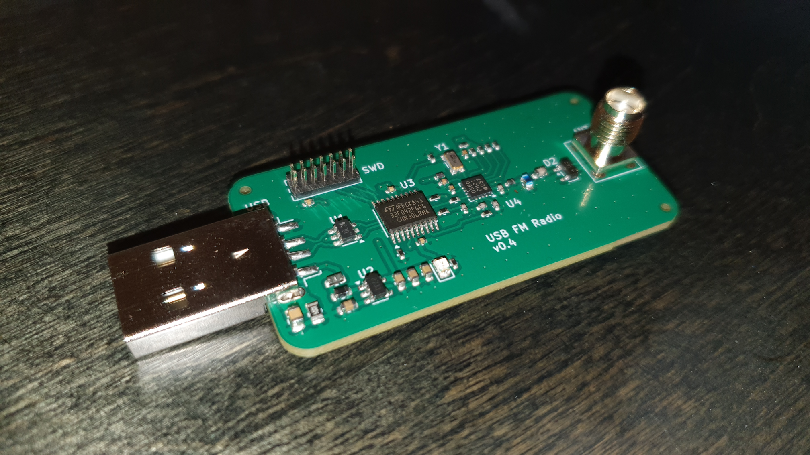

# USB FM Radio



## Overview

This repository presents a USB FM Radio hardware device, consisting of the electronic schematic and PCB layout files drawn with KiCad, a C-language firmware implementation for an STM32 microcontroller and a GUI application for operating the radio device.

> [!IMPORTANT]
> This repository is still under heavy development, and quite many of the things are still unfinished.

Highlights:
 - The schematic consists of an STM32F042-based microcontroller, Si4705-D60 FM Radio Receiver, SG-3030CM crystal oscillator, a radio frontend and the supporting circuitry
 - The microcontroller controls the radio chip via an I2C interface, and receives digital audio from the tuner via an I2S interface
 - The firmware presents a USB 2.0 -compliant USB Audio device for the host computer, together with a Human Interface Device (HID) device for controlling the tuner chip
 - The GUI application allows the user to control the device, tune to a station, adjust volume, and other operations

## Prerequirements & Getting started

> [!IMPORTANT]
> This repository uses Git submodules. Use `git clone --recursive-submodules <url>` to clone everything in one go.
> 
>If you forgot to clone the submodule you can recover with the following commands:
> ```
> cd <local clone directory>
> git submodule update --init
> ```

The repository is structured around a "multi-root workspace" for Visual Studio Code. Thus, you will need VS Code, and you can install it from [here](https://code.visualstudio.com/Download). After installing, open the `usb-fm-radio.code-workspace` file from the root folder.

Both firmware and GUI portions have specific requirements regarding their build environment. Review the README.md files in each subdirectory for more details.

## Where to get an antenna?

In order to effectively receive radio broadcasts you will need an antenna. Any 50 Ohm matched antenna will do fine. I personally used [this antenna](https://www.amazon.com/POBADY-Sections-Telescopic-Connector-Replacement/dp/B09BVNK7WV?th=1) from Amazon

## Copyright & License

This repository consists of both original work by the author, and from work provided by third parties. 

The original work presented in this repository (the KiCad project & files, portions of firmware not originating from a third party, and the GUI application) are copyrighted to the owner of this repository. These portions are entirely licensed under the Creative Commons NonCommercial Sharealike license (CC-BY-NC-SA).

The implications of this license can be found in https://creativecommons.org/licenses/by-nc-sa/4.0/

All other work is copyrighted to their respective owners, and governed by licenses dictated by them. Review the Acknowledgements section for more details.

## Acknowledgements

This repository uses the following work from third parties:
 - Fonts from the DSEG7 series font family. Copyright, license terms and other information related to this font can be found from [keshikan/DSEG](https://github.com/keshikan/DSEG).
 - A forked version of librdsparser. Copyright, license terms and other information related to the library can be found from [kkonradpl/librdsparser](https://github.com/kkonradpl/librdsparser/).
 - A 3D model for the Bat Wireless Coaxial connector, courtesy of [Flux AI](https://www.flux.ai/lcsc/bwsma-ke-z001)
