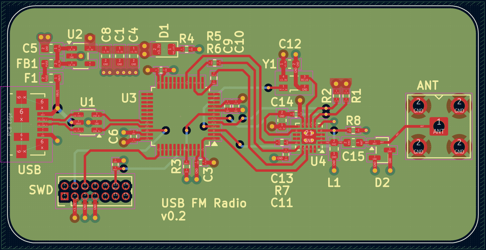
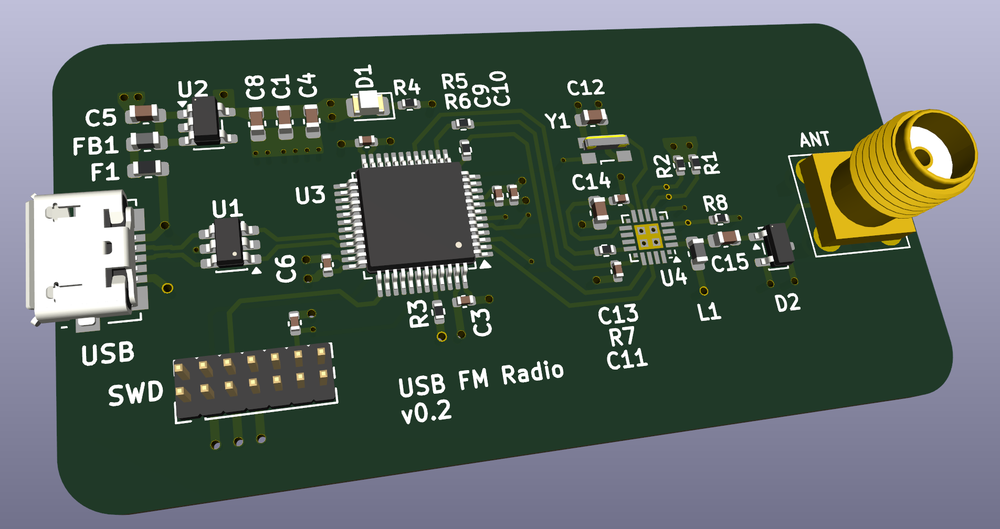

# The schematic

This folder contains the KiCad schematic and PCB layout file for the board.

## Working on the project

To open this project download and install KiCad for your operating system from [this page](https://www.kicad.org/download/).

After installation you need to find and provide the following 3D models, and install them to the model directory of your KiCad installation:
 - Skyworks Si4705-D60
 - BAT Wireless BWSMA-KE-z001
 
These 3D models are not provided in the repository due to copyright reasons.

## Generating the Bill of Materials

The KiCad project file contains a pre-made Bill of Materials definition preset that matches the format expected by JLCPCB. To generate a bill of materials for the project, open the schematic file, first choose "Tools" > "Generate Bill of Materials" and then switch to the "Edit" tab. From the preset selection in bottom-left choose "JLCPCB". Click "Apply, Save Schematic and Continue", and then "Export".

The Bill of Materials file (`radio-circuit.csv`) appears into the `output` folder.

## Generating Gerber, drill and component placement files

The KiCad project file contains the JLCPCB-compatible settings for Gerber and drill files. To generate them open the PCB Editor of the project, and:
 - Choose "File" > "Fabrciation Outputs" > "Gerbers" and "Plot" to generate the `.gbl` files to the `output` folder.
 - Choose "File" > "Fabrication Outputs" > "Drill Files" and "Generate" to generate the `.drl` files to the `output` folder.

Finally, choose "File" > "Fabrication Outputs" > "Component Placement", and click "Generate Position File" to generate the component placement file. The project uses top-side placement only so you can delete the `bottom-pos` file that appears.

### Modifying the component placement file

The file generated is not directly compatible with JLCPCB. You will have to edit the according to [these instructions](https://jlcpcb.com/help/article/How-to-generate-the-BOM-and-Centroid-file-from-KiCAD), from the "Generating Pick and Place files" onwards.

## Acknowledgements

This repository uses a 3D model for the Bat Wireless Coaxial connector, courtesy of [Flux AI](https://www.flux.ai/lcsc/bwsma-ke-z001)